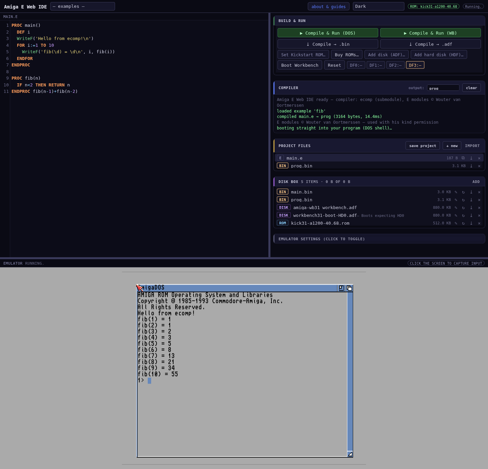
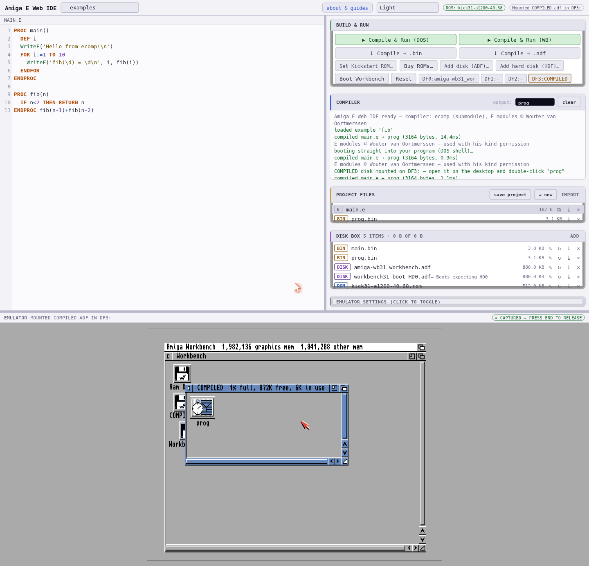
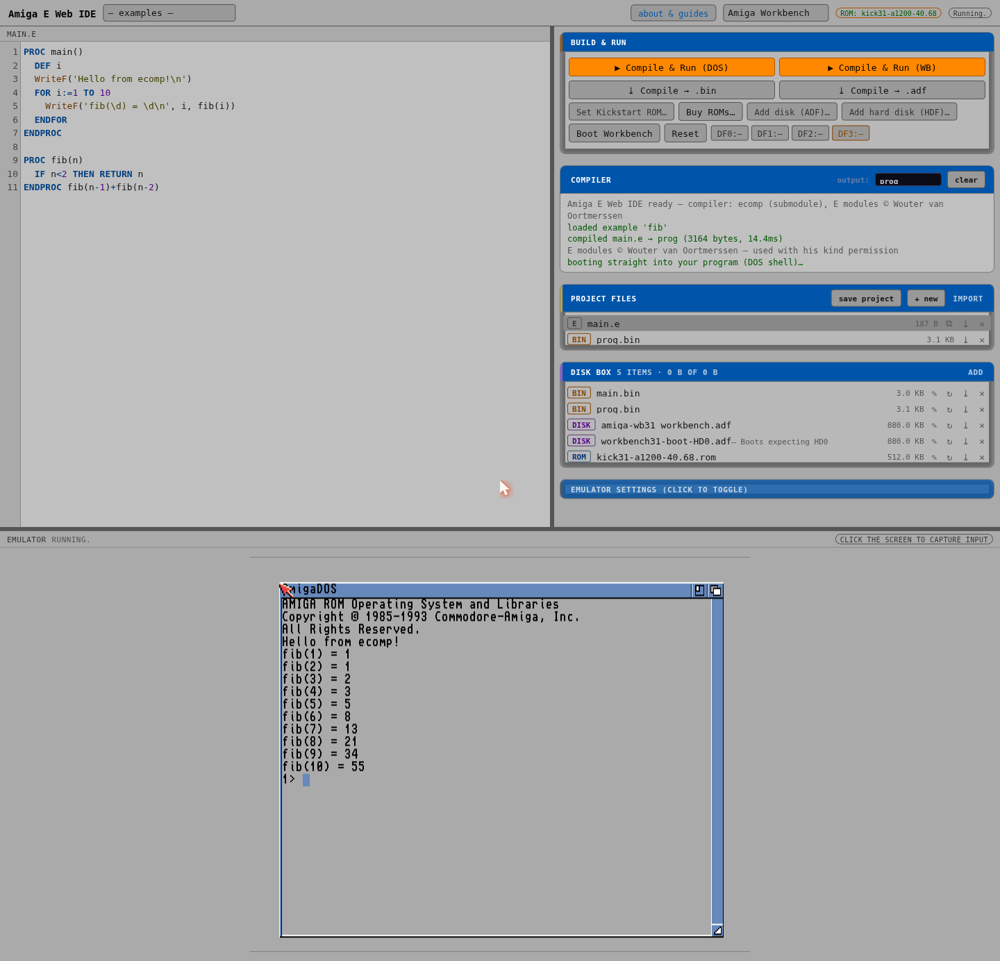

# Amiga E Web IDE

A browser IDE for the **Amiga E** programming language: write E in the
editor, compile it **in your browser** (via the
[ecomp compiler](https://github.com/gin0115/Amiga-E-Compiler-WebBased),
included as a git submodule), and run the result on an emulated Amiga —
all client-side, no server.

> The Amiga E language and its v40 modules are the work of
> **[Wouter van Oortmerssen](https://strlen.com/)**, used with his kind
> permission. Thank you, Wouter!

## Screenshots


*Compile & Run (DOS) — compiled in milliseconds, booted straight into the program.*


*Compile & Run (WB) — the COMPILED drive appears on the live desktop, program icon included.*


*One of four themes — Dark, Light, Amiga Workbench, Solarized (all WCAG AA checked).*

## Layout

- **Top left** — the editor (project files persist in your browser)
- **Top right** — build & run controls, compiler output, project files,
  the **disk box**, and emulator settings
- **Bottom** — the emulator, full width
- Drag the borders to resize.

## Build & Run

| Button | What it does |
|---|---|
| ▶ Compile & Run (DOS) | boots straight into your program — output in the AmigaDOS shell |
| ▶ Compile & Run (WB) | delivers the binary into the *running* Workbench as a `COMPILED` disk |
| ⤓ Compile → .bin | download the AmigaOS executable |
| ⤓ Compile → .adf | download a bootable floppy image |

Delivery into the emulator is pure in-memory disk mounting — no serial,
no parallel, no prompts.

## The disk box

ROMs, Workbench/data disks, hard disk images and built binaries are stored
**in your browser** (IndexedDB — survives reloads, multi-GB quota). Nothing
is uploaded anywhere.

System images are **not included**. Use your own, or buy them legally from
**[Amiga Forever](https://www.amigaforever.com/plus/)** (Kickstart ROMs +
Workbench disks, by Cloanto).

## Setup

```sh
git clone --recurse-submodules git@github.com:gin0115/Amiga-E-Web-IDE.git
# serve the directory with any static web server, then:
#  1. Set Kickstart ROM…  (e.g. kick31 A1200 ROM from Amiga Forever)
#  2. Add disk (ADF)…     (a Workbench 3.1 boot disk)
#  3. pick an example → ▶ Compile & Run (DOS)
```

You also need the SAE emulator engine in `vendor/sae/` —
[Scripted Amiga Emulator](https://github.com/naTmeg/ScriptedAmigaEmulator).

## Emulator settings

Model (A500–A4000), fast RAM, hi-res/double-scan, NTSC — applied on the
next boot, persisted in the browser.
